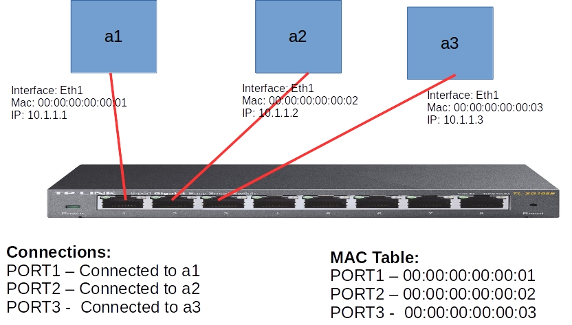
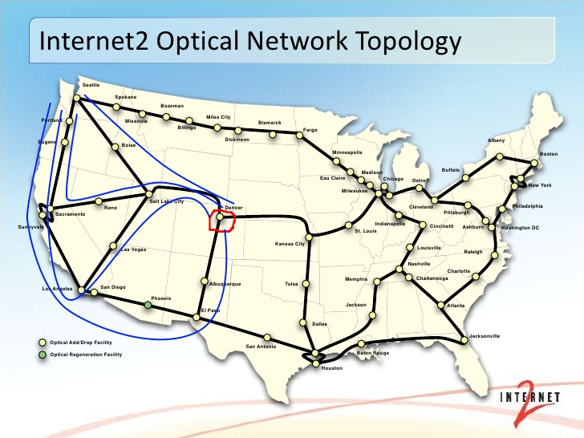

If you have little knowledge about just how you connect to devices like your printer or server in your Local Area Network, just by looking at that picture you learn of a switch.Yeah! A switch is a device that connects others and identifies them by their MAC addresses. More complex than this is a multilayer switch that could even perform routing.

I never used to think that design and technology went hand in hand.  Thus, learning about Network engineering and the role of design has been incredibly interesting to me. Design, implementation, and management are just some of the many things I wish to learn more about. Good art, in a way, makes a person question it. They become joined in the idea of visualization – where captivation meets inspiration.

I am now starting to incorporating Software Engineering in Networks. I hope to learn a lot through the course, but I know it will be just the beginning of my journey. By the time I’m done with it, I hope I’ve learned enough to take the next step in my life as a Network developer. But until then, my fire will keep on burning.

