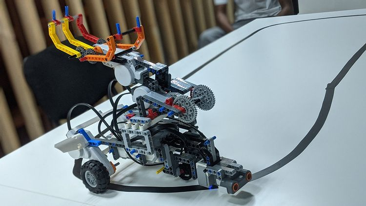

Checkout wall climber and mountain climber

<a href="https://drive.google.com/file/d/1nALw5E7-JXrmX31_kW7H3qsrn8nBQoON/view?usp=sharing" >wall climber</a>
<a href="https://drive.google.com/file/d/1MvvNOZsJ_ywHNlDivV3LYG4eweUM9Ph8/view?usp=sharing" >mountain climber</a>

Robot is a compendium of robotics systems developed during our stay at tsquaredrobotics where by we programmed them to achieve specific tasks.

Two main robots consist of a wall climber and a mountain climber which were robots developed by pushing beyond the programming capabilities of the Lego Mindstorm Education Version 3. The limitation states that you cannot turn on 4 motors at once even if they can be attached at once on the same controller.

The circumvented this limitation by turning on a pair of motors at once and rotating in the same direction from the same side for a period of a tenth of a second and shutting down while the other pair of motors located on the same side, turns on for a tenth of a second and rotates in the opposite direction of the first pair and finally shuts.
We held this flow in a loop and provided the robot with a place that is a straight wall that could allow the calculations to lift the robot and climb the wall which was our intended goal.

The mountain climber is similar in programming though both pairs rotate in the same direction, and the use of a spring mechanism was invented to allow the robot to swing between faulty areas where wheels could easily get stuck.

In this project I gained experience with a functional robot and programming logic, including [EV3](https://education.lego.com/en-us/downloads/mindstorms-ev3/software)) for programming, the [Lego Mindstorms](https://www.lego.com/en-us/product/lego-mindstorms-ev3-31313) for robot construction. 
 
#Source: <a href="https://github.com/theVacay/vacay"><i class="large github icon"></i>theVacay/vacay</a>
