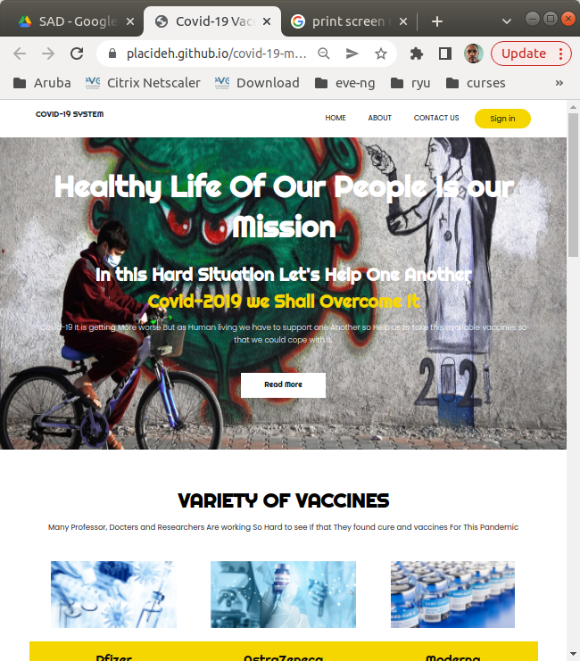
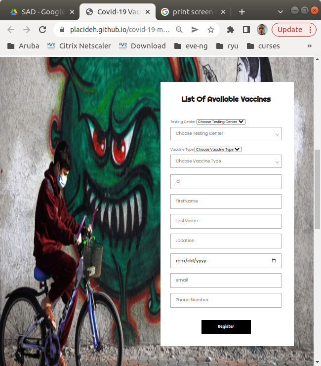
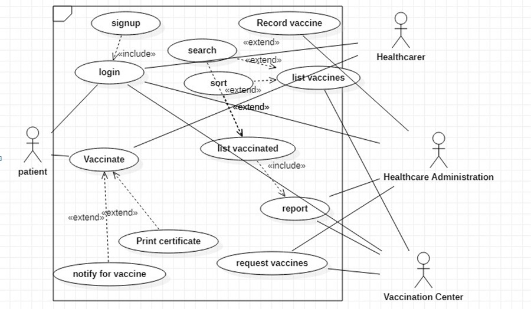
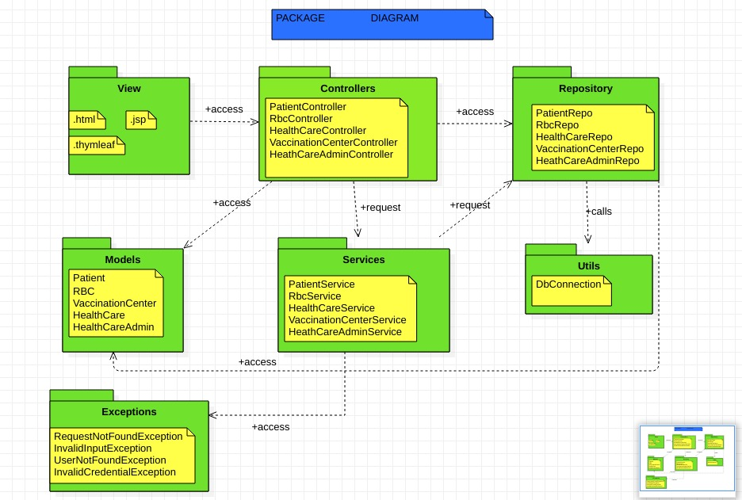

  
  

Covid-19 Vaccination System is an application system which helps in collecting information for outbreak diseases, and in this particular case, Corona. The system is made up of a front-end User Interface that helps in filling registration form and a backend database that helps in recording the information from the user. The system now helps need to keep track of patients who recently contracted the disease and facilitates them to schedule appointment with a medical practicioner. It records the vaccination process from start to finish and awards a certificate on the last prescription taken.

The system also helps the medical institution report to the ministry of health on status of the outbreak providing information like the tally of the sick, rate of contraction, preferred vaccination medicine and much more.

For this project, I was the UML designer who was responsible for designing the database schema, providing diagrams of deployment, classes, Entity Relationship, Data Flow and many others.  I started by designing a meaningful Use Case diagram detailing the functions and actors of the systems.
There were many actors involved so I had to compress usecases to make diagram comprehensible to the programmer. I then moved on to class and entity relationship diagram which made a way for the programmer to start coding, and lastly I designed the Sequence, Data Flow and Deployment diagram.

  

You can learn more at the [github](https://github.com/mikangabo/covid-19-management-system/).

